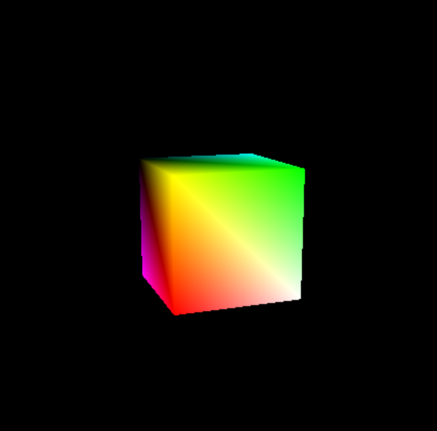

# rotating-cube
A multi-colored cube simulation that rotates:

This simulation can be run using XCode.

Once you have the cube simulated:

Press `x` to rotate the cube on the x-axis.
Press `y` to rotate the cube on the y-axis.
Press `z` to rotate the cube on the z-axis.
